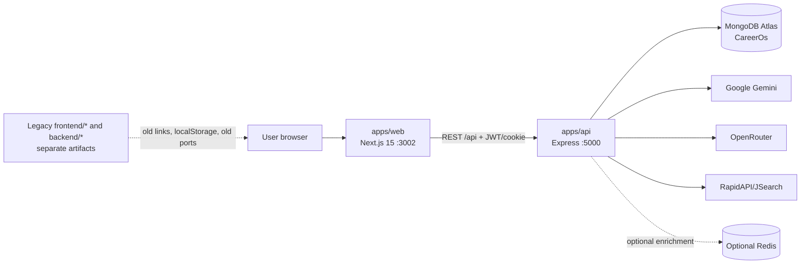
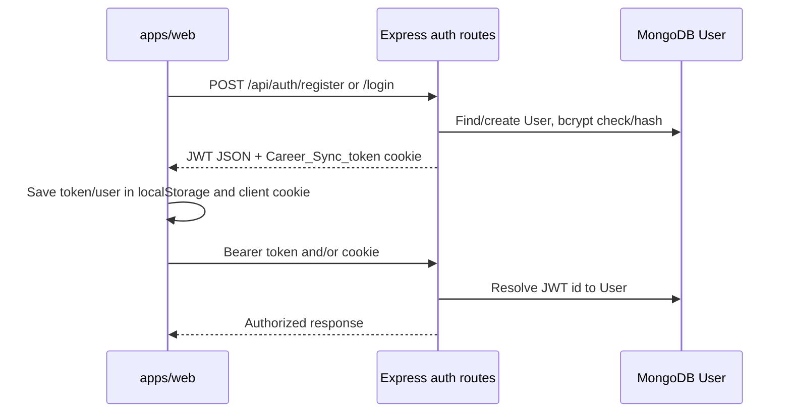

# CareerOS Phase 1 Architecture Report

Date: 2026-10-03
Scope: Architecture and codebase-unification preparation only

## Status and Guardrails

The repository was inspected before editing.

- Branch: `career-sync-baseline`
- HEAD: `eee2ba0 chore: correct web startup port message`
- Pre-existing modified files: `deploy.js`, `frontend/course-generation/components/Header.tsx`, `frontend/roadmap/public/shared/header-component.js`, `frontend/shared/header-component.js`, `frontend/test-generation/index.html`, and `package.json`.
- Pre-existing untracked file: `apps/TaskProvider`.
- No existing files were deleted, overwritten, migrated, or reformatted.
- This report is the only Phase 1 artifact added.

## A. Current Architecture

### Frontend

The current unified frontend is `apps/web`:

- Next.js 15.5.3 App Router, React 18, TypeScript and JavaScript.
- Tailwind CSS, Radix UI primitives, `lucide-react`, SWR, React Hook Form and Zod.
- Route groups under `apps/web/app/(marketing)` and `apps/web/app/(app)`.
- Shared layout in `apps/web/app/layout.tsx`; authenticated route protection in `apps/web/middleware.ts`.
- Shared API client in `apps/web/lib/api.ts` and feature-specific clients under the roadmap and assessment trees.
- Global authentication context in `apps/web/contexts/AuthContext.tsx`.
- Local browser state is still used by several feature screens for course modules, assessment handoff, roadmap snapshots, user data and UI preferences.

Legacy frontend artifacts remain under `frontend/`. They include a generated Next.js course application, a Vite/React roadmap build, a static evaluator, and a static landing application. They are not the documented active frontend, but `deploy.js` still attempts to start their topology.

### Backend

The current backend is `apps/api`:

- Express 4 running under Node.js with `tsx` for mixed JavaScript/TypeScript services.
- Entry point: `apps/api/server.js`.
- Middleware: CORS, Helmet, rate limiting, cookies, JSON parsing, JWT authentication and MongoDB availability checks.
- Route groups: auth, courses, course generation v2, roadmaps, skills and profile.
- Services include course orchestration, curriculum validation, module expansion, resource resolution, title generation, content intelligence and email delivery.
- Error handling is centralized at the Express application level, while routes also catch and shape their own errors.

### Database

- MongoDB Atlas through Mongoose 8.
- Database name is supplied by the `MONGODB_URI`; the active local environment connected to `CareerOs`.
- Models: `User`, `Course`, `CourseGeneration`, `Roadmap`, `SkillEvaluation` and `UserEnrollment`.
- Primary user identity is MongoDB `ObjectId`; string `userId` and `userEmail` are also duplicated on several documents for compatibility with guest/legacy flows.
- Course, roadmap and evaluation documents contain progress/status fields. Enrollment is stored separately in `UserEnrollment`.
- `apps/web/lib/prisma.ts` and the web database setup scripts are legacy/unused-looking Prisma-era artifacts; the active API writes through Mongoose.

### Authentication

- Active server authentication is email/password or OTP through `apps/api/routes/auth.js`.
- Passwords use bcrypt; access tokens are JWTs signed with `JWT_SECRET`.
- The API sets an HttpOnly `Career_Sync_token` cookie and also returns a token in JSON.
- API middleware accepts the cookie or an `Authorization: Bearer` header.
- The active web app stores the returned token in localStorage, mirrors it into a client-written `Career_Sync_token` cookie, and sends it as a Bearer token when needed.
- The web middleware checks only the cookie for route gating; the backend remains the authority for API authorization.
- URL auth bootstrap (`auth_token` and `auth_user`) and localStorage fallback remain for cross-domain/legacy navigation.

### AI and feature ownership

| Feature | Active frontend | Active backend | AI/provider | Persistence |
|---|---|---|---|---|
| Course generation | `apps/web/app/(app)/generate/[topic]` and Next route `/api/generate-course` | `apps/api/routes/courses.js` and `/api/generate-course-v2` | OpenRouter for modular generation; Gemini also exists in the older course route; optional YouTube/resource enrichment | `CourseGeneration`, `Course` |
| Skill evaluation | `apps/web/app/(app)/assessments` | `apps/api/routes/skillEval.js` | Gemini `gemini-2.0-flash`, with fallback question/profile logic | `SkillEvaluation` |
| Roadmap generation | `apps/web/app/(app)/roadmaps` | `apps/api/routes/roadmaps.js` | Gemini `gemini-2.0-flash`; RapidAPI/JSearch for jobs | `Roadmap` |

### Deployment

- `render.yaml` deploys `apps/api` as a Render web service.
- `README.md` documents `apps/web` as a separate Vercel deployment.
- `deploy.js` is an older multi-process launcher for ports 5000, 4173, 3002, 5173 and 3001. It does not launch the active `apps/api` and `apps/web` pair.
- The repository therefore has a unified code layout but not one coherent deployment process yet.

## B. Application and Module Map



| Boundary | Directory | Framework/runtime | Port | Communication |
|---|---|---|---:|---|
| Main CareerOS frontend | `apps/web` | Next.js 15, React 18 | 3002 | Browser calls `apps/api` through `NEXT_PUBLIC_API_URL`; Next server routes also call providers directly |
| Main CareerOS API | `apps/api` | Express 4, Node.js, `tsx` | 5000 | REST, JWT Bearer/cookie, Mongoose |
| Course module | `apps/web` course routes plus `apps/api` courses and course-generation-v2 | Next/React plus Express services | 3002/5000 | REST; duplicate Next and Express generation paths |
| Roadmap module | `apps/web` roadmap tree plus `apps/api/routes/roadmaps.js` | Next/React plus Express | 3002/5000 | REST proxy, local fallback, MongoDB |
| Skill module | `apps/web` assessments plus `apps/api/routes/skillEval.js` | Next/React plus Express | 3002/5000 | REST, JWT/cookie, MongoDB |
| Legacy course app | `frontend/course-generation` | Generated Next.js artifact; lockfile identifies Next 14, Prisma, Supabase and NextAuth dependencies | historical | Old cross-application links and shared storage |
| Legacy roadmap app | `frontend/roadmap` | Vite, React, TypeScript, Supabase-era dependencies | historical | Static build, shared header/auth artifacts |
| Legacy evaluator | `frontend/test-generation` | Static HTML/JavaScript | historical | Old module URLs and browser storage |
| Legacy backend | `backend/main-app/backend` | Separate Node backend artifact | historical | Old launcher path |

## C. Authentication Map



Observed authentication implementations:

- `apps/api/routes/auth.js`: registration, login, OTP login, password reset, logout, token verification and device/session bookkeeping.
- `apps/api/middleware/auth.js` and `apps/api/utils/token.js`: JWT extraction from Bearer header or `Career_Sync_token` cookie.
- `apps/web/contexts/AuthContext.tsx`: login, periodic `/auth/me`, localStorage fallback, URL parameter bootstrap and client cookie mirroring.
- `apps/web/middleware.ts`: route protection based on `Career_Sync_token` cookie and optional URL bypass.
- `apps/web/lib/api.ts` and feature clients: Bearer token lookup from several differently named localStorage keys.
- Legacy frontend assets use additional localStorage keys, old headers and cross-domain URL handoff.

Fragmentation and risks:

- The server cookie is HttpOnly, but the web app also creates a non-HttpOnly cookie with the same name.
- Token keys include `careersync_token`, `Career_Sync_token`, `Career Sync_token` and legacy `token` usages.
- URL parameters can carry authentication material when the bypass is enabled.
- `apps/web` can mark a user authenticated from localStorage when the API is unavailable; this is UI state, not authorization, but can create stale sessions.
- Legacy apps have their own auth helpers and historical provider assumptions.
- There is no refresh-token implementation; JWT expiration is seven days.

## D. Data Map

| Data | Storage/model | User association | Durable fields |
|---|---|---|---|
| User | MongoDB `User` | `_id`, unique lowercase email | password hash, profile, role/status, OTP fields, device/session metadata |
| Generated course | MongoDB `Course` and `CourseGeneration` | `user` ObjectId plus legacy `userId`/`userEmail` | modules, objectives, difficulty, status, progress, completed modules, generation metadata |
| Course enrollment | MongoDB `UserEnrollment` | required `user` ObjectId plus string/email | course id/title, module count, progress, completion and access timestamps |
| Roadmap | MongoDB `Roadmap` | optional `user` ObjectId plus string/email | roles, timeline, text, stages, milestones, progress and status |
| Roadmap enrollment | MongoDB `UserEnrollment` | required `user` ObjectId plus string/email | roadmap id/title, stages, progress and creation date |
| Skill evaluation | MongoDB `SkillEvaluation` | optional ObjectId plus string/email | skill, difficulty, questions, answers, score, feedback, status and completion date |
| Evaluation enrollment | Model fields exist in `UserEnrollment` | string evaluation id/title | score and completion date; route usage is not established as a primary flow |

Browser-only or temporary data observed:

- Assessment course name and result handoff use `sessionStorage`.
- Course topic/module data and some course fallback state use `localStorage`.
- Roadmap saved snapshots use localStorage before/alongside API enrollment.
- Auth token and user snapshots use localStorage in the active frontend and legacy applications.
- Educator application and UI collapse preferences use localStorage.
- React state holds active assessment, roadmap simulation and generated response data until persistence is called.
- Next.js route responses are temporary unless the corresponding API save succeeds.

These are direct causes of refresh/re-login loss when a save call is skipped, fails, or is only stored in browser state.

## E. API Map

All active Express routes are mounted below `/api` in `apps/api/server.js`.

### Auth

| Method/path | Auth | Purpose and persistence |
|---|---|---|
| POST `/auth/register`, `/auth/signup` | No | Create `User`, return JWT/cookie |
| POST `/auth/login` | No | Verify `User`, update device/login data, return JWT/cookie |
| POST `/auth/request-otp` | No | Store hashed OTP on `User`, send EmailJS message |
| POST `/auth/login-otp` | No | Verify OTP, update device/login data, return session data |
| POST `/auth/reset-password` | No | Verify OTP and update password hash |
| POST `/auth/verify` | No | Verify supplied JWT and resolve user |
| POST `/auth/logout` | No | Clear cookie |
| GET `/auth/me`, `/auth/devices` | Yes | Resolve current user and device data |
| POST `/auth/sync-devices`, `/auth/update-profile`, `/auth/logout-all-devices` | Yes | Update user/device/session data |

### Courses and course generation

| Method/path | Auth | Purpose and persistence |
|---|---|---|
| POST `/courses/generate-questions` | Optional/route-dependent | Course wizard question generation |
| POST `/courses/generate` | Route-dependent | Older Gemini course generation path |
| POST `/courses/save` | Yes | Save `Course` for current user |
| POST `/courses/:id/progress` | Yes | Persist course progress |
| GET `/courses`, `/courses/:id` | Yes/optional | List owned courses or retrieve an owned/public course |
| POST `/generate-course-v2` | Route currently accepts topic/answers; auth persistence is conditional | Modular course orchestration, creates `CourseGeneration` and `Course` when a user is attached |
| GET `/enrich/status/:jobId` | No | Check optional enrichment job status |

The active Next.js route `/api/generate-course` is a second generation implementation. It calls OpenRouter directly and is separate from Express `/api/generate-course-v2`.

### Roadmaps

| Method/path | Auth | Purpose and persistence |
|---|---|---|
| POST `/roadmaps`, `/roadmaps/create` | Yes | Create/save `Roadmap` |
| POST `/roadmaps/generate` | Optional | Gemini generation and `Roadmap` persistence |
| POST `/roadmaps/ai-generate` | Route-specific authentication behavior | Gemini proxy for the frontend simulation workflow; response is primarily text |
| GET `/roadmaps`, `/roadmaps/:id` | Yes/optional | List and retrieve roadmaps with ownership checks |
| PUT `/roadmaps/:id/progress` | Yes | Persist roadmap progress |
| POST `/roadmaps/jobs-search` | Authenticated | RapidAPI/JSearch proxy |

### Skills

| Method/path | Auth | Purpose and persistence |
|---|---|---|
| POST `/skills/` | Yes | Create a persisted evaluation record |
| POST `/skills/analyze-profile` | Authenticated in route | Gemini/fallback profile skill analysis; response is not itself a saved evaluation |
| POST `/skills/evaluate` | Optional | Generate questions through Gemini and persist when a user is present |
| POST `/skills/submit` | Yes | Score and update a `SkillEvaluation` |
| GET `/skills/config-check` | No | Report configuration flags; exposes key length and should be treated as diagnostic-only |
| GET `/skills`, `/skills/:id` | Yes/optional | List or retrieve evaluations with ownership behavior |

### Profile and enrollment

| Method/path | Auth | Purpose and persistence |
|---|---|---|
| POST `/profile/enroll/course` | Yes + Mongo | Create `UserEnrollment` course record |
| POST `/profile/enroll/roadmap` | Yes + Mongo | Create `UserEnrollment` roadmap record |
| GET `/profile/:userId` | Yes + Mongo | Aggregate owned courses, roadmaps, evaluations and enrollments |
| PUT `/profile/progress/course/:courseId`, `/profile/progress/roadmap/:roadmapId` | Yes + Mongo | Update progress |
| POST `/profile/sync` | Yes + Mongo | Profile synchronization path |

Important contract inconsistency: `profile.js` validates `courseModules` as an array, while `UserEnrollment.courseModules` is a Number and phase 0 sends `courseModules: 3`. The implementation/schema and route validator disagree. The phase 0 failure is therefore a real contract defect, not merely a bad test assertion. The application intent is most likely a module count because the schema field is numeric, but this must be resolved in a later implementation phase.

## F. Duplicate and Conflicting Systems

| Area | Findings |
|---|---|
| Authentication | Active Express JWT/cookie system, active web localStorage fallback, URL auth bootstrap, and legacy frontend auth helpers |
| Course APIs | Next.js `/api/generate-course`, Express `/api/courses/generate`, Express `/api/generate-course-v2`, plus legacy Next routes in generated artifacts |
| Roadmap APIs | `/generate`, `/ai-generate`, `/`, `/create`, and frontend-local simulation/fallback contracts |
| User identifiers | MongoDB ObjectId, string `userId`, email, guest values and URL/localStorage user objects |
| Database logic | Active Mongoose; legacy Prisma/Supabase-era dependencies and scripts remain |
| AI logic | Gemini is used for roadmaps/skills and an older course path; OpenRouter is used for modular courses and the Next course route |
| State | MongoDB persistence mixed with React state, localStorage and sessionStorage |
| Deployment | Render API blueprint, Vercel frontend instructions, old root multi-process launcher, historical frontend builds |
| Background work | BullMQ/ioredis worker code exists, but the active API package does not declare those dependencies |

## Reuse Classification

| Classification | Current code |
|---|---|
| KEEP | `apps/web` route/layout/design system; `apps/api/server.js`; Mongoose models; Mongo connection; JWT middleware; ownership helpers; course validation and resource services; phase 1 ownership checks |
| ADAPT | `apps/web/contexts/AuthContext.tsx`, middleware and API clients; roadmap/assessment clients; profile/enrollment routes; environment files; deployment scripts |
| MERGE | Next.js and Express course generation paths; roadmap `/generate` and `/ai-generate` contracts; duplicate token keys and user identity fields; active and legacy API client conventions |
| REPLACE | No replacement is required in Phase 1. Any later replacement must be justified by parity tests; no framework replacement is recommended. |
| REMOVE LATER | `frontend/course-generation`, `frontend/roadmap`, `frontend/test-generation`, obsolete `backend/main-app/backend`, and the old `deploy.js` topology after migration parity and rollback coverage |

## Environment Variable Inventory

Actual secret values are intentionally omitted.

| Variable | Used by | Purpose | Scope/status |
|---|---|---|---|
| `PORT` | API/web scripts | Listener port | Development; separate defaults exist |
| `NODE_ENV` | API and auth | Runtime behavior/cookie/security mode | Development/production |
| `MONGODB_URI` | API/models/scripts | MongoDB Atlas connection | Backend-only, sensitive, required |
| `DATABASE_URL` | Root/legacy web setup scripts | Legacy Prisma/database setup | Duplicate/likely obsolete for active Mongoose API |
| `JWT_SECRET` | API auth | JWT signing | Backend-only, sensitive, required in production |
| `NEXT_PUBLIC_API_URL`, `NEXT_PUBLIC_API_BASE_URL` | Web clients | API base URL | Browser-visible; duplicate names, one should become canonical |
| `ENABLE_URL_AUTH_BYPASS`, `NEXT_PUBLIC_BYPASS_AUTH`, `BYPASS_AUTH` | Web/API auth paths | Development authentication bypasses | Development-only; must be disabled in production |
| `GEMINI_API_KEY` | API roadmaps, skills and older courses | Gemini generation | Backend-only, sensitive, required for live AI paths |
| `OPENROUTER_API_KEY` | API course services and web server route | Course generation and embeddings | Server-only, sensitive |
| `OPENAI_API_KEY`, `NEXT_PUBLIC_OPENAI_API_KEY` | Embedding helpers/test paths | Optional embeddings | Server-only for real use; `NEXT_PUBLIC_*` variant is unsafe for secrets |
| `YOUTUBE_API_KEY`, `NEXT_PUBLIC_YOUTUBE_API_KEY` | API workers and web video services | Video/resource enrichment | Duplicate server/browser forms; browser form is exposed by design |
| `RAPIDAPI_KEY` | API roadmap jobs search | JSearch proxy | Backend-only, sensitive; previously leaked in history and should be rotated |
| `EMAILJS_SERVICE_ID`, `EMAILJS_TEMPLATE_ID`, `EMAILJS_PUBLIC_KEY`, `EMAILJS_PRIVATE_KEY` | API auth/email service | OTP delivery | Backend-only; private key sensitive |
| `REDIS_URL`, `REDIS_HOST`, `REDIS_PORT`, `REDIS_PASSWORD` | API queue/workers | Optional enrichment queue | Not fully wired in active package/deployment |
| `CORS_ORIGINS` | API config/deployment | Production frontend allowlist | Backend deployment setting |
| `NEXTAUTH_URL`, `NEXTAUTH_SECRET` | Root/legacy environment | Historical NextAuth configuration | Duplicate/unused-looking in active Express JWT architecture |
| `VITE_*` values | Legacy Vite roadmap | Legacy frontend configuration | Legacy only |

Deployment configuration inventory:

- Render: `render.yaml` exists and deploys `apps/api`.
- Vercel: no repository Vercel configuration file was found; deployment is documented in `README.md` with `apps/web` as root directory.
- Docker: no Dockerfile or Compose configuration was found.
- Netlify: no Netlify configuration was found.
- Other hosting: legacy Render URLs and old multi-port launch behavior remain in generated/legacy frontend assets and `deploy.js`.

## G. Persistence Problems

1. Some feature flows render useful data before they save it; refresh loses React state.
2. Assessment navigation uses sessionStorage, so closing the tab or changing browser context loses the handoff.
3. Course topic/module pages read localStorage and can fall back when API persistence fails.
4. Roadmap simulation saves a local snapshot and separately calls API enrollment; those operations can diverge.
5. Auth localStorage fallback can show stale user state even when the backend session is invalid.
6. Several components use different token key names, so one login is not reliably visible to every legacy path.
7. Course enrollment is currently blocked by the array-vs-number validator/schema mismatch.
8. Guest/optional-auth generation can return data without a durable user association.

## H. Recommended Target Architecture

Use the existing strongest active implementation as the base rather than introducing a new framework:

```text
CareerOS
├── apps/web       Next.js 15 unified frontend
├── apps/api       Express API and feature services
├── shared         Typed request/response contracts added incrementally
└── MongoDB Atlas  single persistence system
```

Recommended ownership:

- Keep `apps/web` as the only frontend.
- Keep `apps/api` as the only backend.
- Keep Express/Mongoose/JWT as the server foundation.
- Keep Gemini for roadmaps and skill evaluation.
- Select one course generation implementation, preferably the modular Express orchestrator, and make the Next route a thin proxy or retire it after parity testing.
- Normalize all feature identity to the authenticated MongoDB user ObjectId; retain compatibility fields only during migration.
- Make every generated artifact use an explicit create/save operation with a durable status.
- Treat localStorage/sessionStorage as UX cache only, never the source of truth.
- Add shared schemas/contracts before changing endpoints.
- Keep Redis/BullMQ out of the critical path until its dependencies, connection settings and worker deployment are made explicit.

A true single deploy would require one Node process to own both Next.js and Express on one port. The safer intermediate deployment is one repository with one active frontend service and one active API service; it is still one product and avoids coupling two server lifecycles prematurely.

## I. Migration Plan

| Phase | Work | Dependencies | Main risks |
|---|---|---|---|
| Phase 2 - Unified Authentication | Select one token/cookie convention; remove URL auth and localStorage authority gradually | Current auth map; compatibility window | Logging users out, cookie/CORS errors |
| Phase 3 - Unified Database & Persistence | Standardize ObjectId ownership, remove guest ambiguity, define progress/enrollment contracts | Phase 2 identity; migration/backfill plan | Cross-user reads, duplicate records, data loss |
| Phase 4 - Course Generator Integration | Choose Express modular path, align request/response schemas, preserve generated-course behavior | Shared contracts, OpenRouter/resource decisions | AI output regression, enrichment failures |
| Phase 5 - Roadmap Integration | Choose `/generate` or `/ai-generate`, persist structured stages and progress consistently | User ownership and roadmap schema | Lost simulations, inconsistent JSON/text response |
| Phase 6 - Skill Evaluator Integration | Standardize evaluation lifecycle and history; connect results to user profile | Auth and evaluation schema | Incorrect scoring or orphaned attempts |
| Phase 7 - Unified Dashboard & UI | Replace browser-only sources with API-backed queries and loading/error states | All durable feature APIs | UX regressions and stale caches |
| Phase 8 - Integration Testing | Add end-to-end tests for auth, generation, persistence, refresh and ownership | Stable contracts | Tests masking contract mismatches |
| Phase 9 - Production Deployment | Decide one-service or two-service deployment; configure secrets and CORS | Passing integration suite; Redis decision | Bad envs, CORS, Mongo network access |
| Phase 10 - Cleanup | Retire legacy applications, launchers, duplicate routes and compatibility code | Production parity and rollback plan | Removing a still-used legacy path |

## J. Files and Directories Likely to Change Later

- `apps/web/contexts/AuthContext.tsx`
- `apps/web/middleware.ts`
- `apps/web/lib/api.ts`
- `apps/web/app/(app)/generate/[topic]/page.tsx`
- `apps/web/app/api/generate-course/route.ts`
- `apps/web/app/(app)/roadmaps/_app/services/{simulationService,roadmapService,assessmentService}.ts`
- `apps/web/app/(app)/assessments/_app/utils/geminiApi.js`
- `apps/web/app/(app)/course-generated/[id]/page.tsx`
- `apps/api/routes/auth.js`
- `apps/api/middleware/auth.js`
- `apps/api/utils/token.js`
- `apps/api/routes/{courses,course-generation-v2,roadmaps,skillEval,profile}.js`
- `apps/api/models/{User,Course,CourseGeneration,Roadmap,SkillEvaluation,UserEnrollment}.js`
- `apps/api/services/generationOrchestrator.ts` and related course services
- `apps/api/scripts/verify-phase0.mjs`
- `apps/api/package.json` if Redis/BullMQ workers are activated
- `render.yaml`, root scripts and deployment documentation after migration parity exists

## K. Files and Implementations to Preserve

- `apps/api/server.js` health, middleware and route mounting
- `apps/api/db/mongo.js`
- `apps/api/middleware/auth.js` and ownership helpers
- Mongoose models and indexes until a reviewed schema migration exists
- `apps/api/services/generationOrchestrator.ts` and course validation/resource services
- Roadmap and skill route fallback behavior until equivalent production behavior is tested
- `apps/web` route structure, shared layout, design system and active feature components
- Existing phase 1 ownership verification script, with its contracts corrected deliberately later

## L. Critical Risks

- **User data loss:** browser-only course, roadmap and assessment state can disappear before persistence.
- **Authentication loss:** changing token keys or cookie attributes can invalidate every active session.
- **Cross-user leakage:** duplicated `user`, `userId` and email ownership filters must remain consistent.
- **Database corruption:** changing numeric enrollment fields or mixed module schemas without a migration can make existing records unreadable.
- **Production deployment failure:** Render and Vercel currently have separate environment/CORS contracts; the old launcher points at obsolete paths.
- **AI regression:** course generation has multiple providers and response formats; consolidating without golden fixtures will change output behavior.
- **Secret exposure:** only server-side variables should contain MongoDB, JWT, Gemini, OpenRouter, EmailJS and RapidAPI credentials. `NEXT_PUBLIC_*` variables are browser-visible by design.
- **Worker failure:** course enrichment imports Redis/BullMQ code that is not represented as a complete active API dependency/runtime.
- **Diagnostic leakage:** skill configuration diagnostics expose key metadata such as length and should not be treated as a public production endpoint.

## Baseline Verification

| Check | Result | Evidence |
|---|---|---|
| API starts | PASS | Express started on port 5000 |
| MongoDB connection | PASS | MongoDB Atlas connected to `CareerOs` |
| `/api/health` | PASS | `status: OK`, MongoDB configured/connected |
| Backend service checks | PASS with test defect | Functional service summary completes; content-intelligence assertion calls `.then` on a synchronous return |
| Phase 0 verification | FAIL: 8 passed, 1 failed | Enrollment request receives 400 because validator requires an array while model/test use a number |
| Phase 1 verification | PASS: 6 passed, 0 failed | Auth, ownership and course deduplication checks pass |
| Active web production build | PASS | Next.js compiled, type/lint checks passed, 25 pages generated |
| Active web server | PASS | Homepage served HTTP 200 on port 3002 during baseline run |
| Production deployment | NOT TESTED | No production deployment was changed or exercised in Phase 1 |

## Final Phase 1 Status

```text
PHASE 1 STATUS: COMPLETE

Architecture understood: YES
Authentication mapped: YES
Database mapped: YES
APIs mapped: YES
Modules mapped: YES
Deployment mapped: YES
Baseline tests completed: YES

Ready for Phase 2: YES
```

Phase 2 should begin with a reviewed authentication contract and the course enrollment contract decision. No Phase 2 migration was performed automatically.